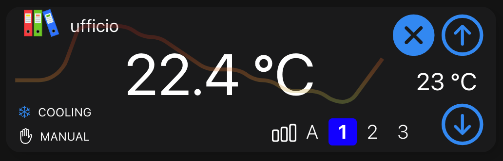
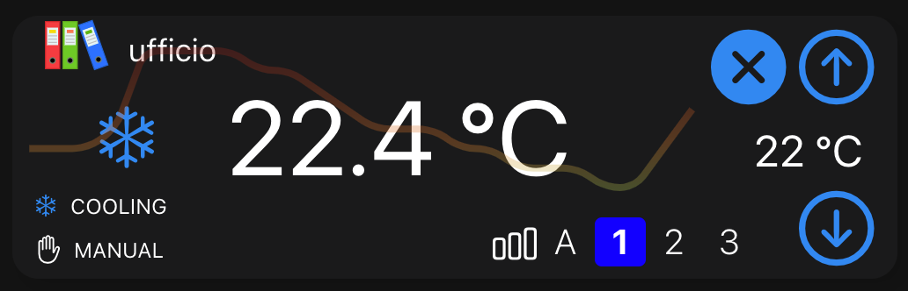
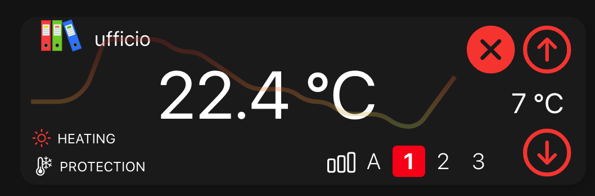
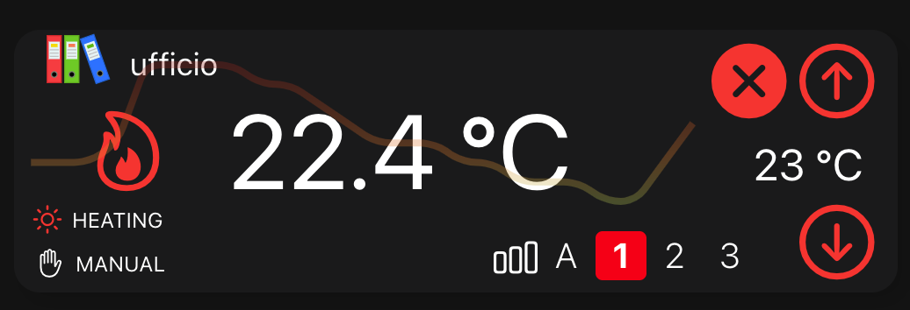

# OpenHabWidgets
Custom widgets for OpenHab 3.x 

It supports following properties:

- **Title** small title on top of the card
- **Icon** on top of the card (only OH icons (without oh:))
- **Background Color** in rgba() or HEX or empty
- **Current Temperature** 
- **Set Temperature**
- **Function** Heating/Cooling/Generic
- **Mode** Off/Protection/Manual
- **Fan Speed** Auto, 1, 2, 3

### COOLING mode

### HEATING mode

